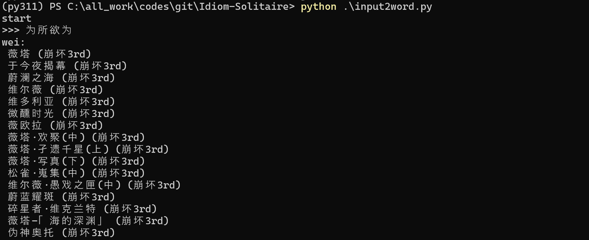
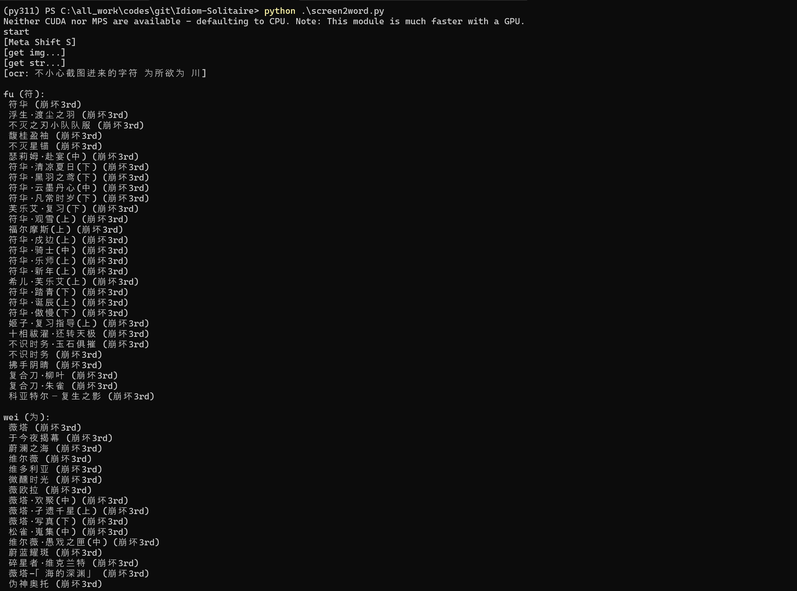

# Idiom-Solitaire

成(词)语接龙自定义词库版

```sh
# 对汉字或拼音输入进行接龙
python input2word.py

# 截屏后自动读取剪贴板, 进行文字识别并接龙
python screen2word.py
```

## Example

此处接入了崩三词库

 

## Env

CPU:

```sh
conda create -y -n py311 python=3.11
conda install pytorch==2.2.2 torchvision==0.17.2 torchaudio==2.2.2 cpuonly -c pytorch -y
conda install pillow==9.4.0 numpy easyocr cpuonly -c pytorch -y
pip install keyboard pypinyin
```
